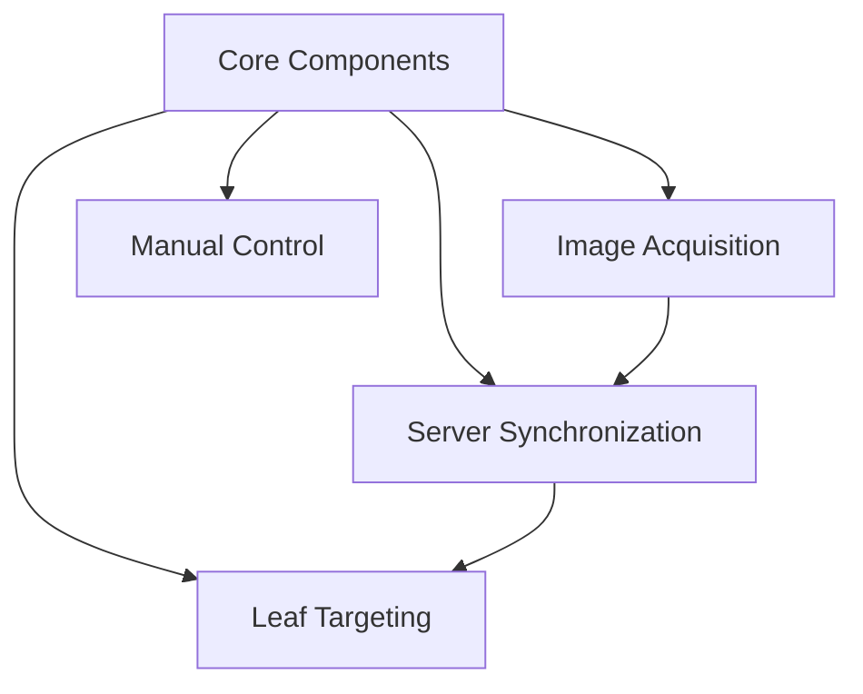
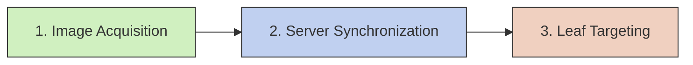
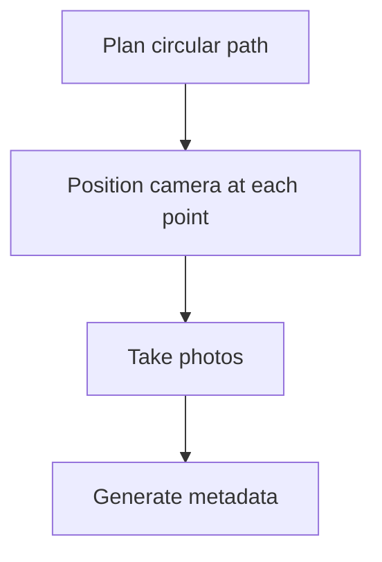
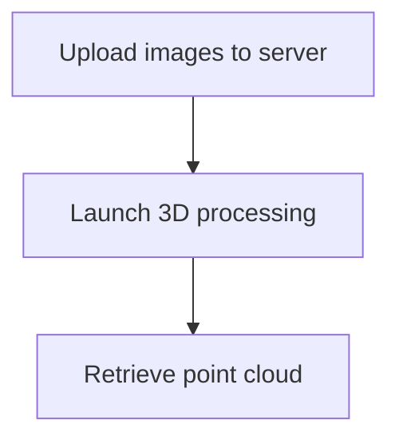
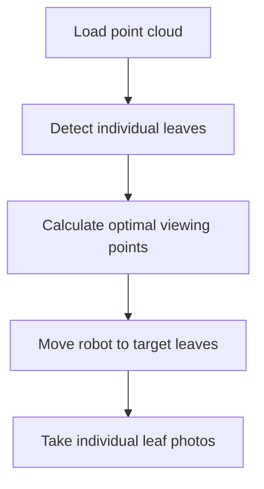

# System Architecture

This document presents the system architecture and the interactions between different modules of the Plant Imaging and Leaf Targeting System.

## Core Components and Modules

The system is organized around a central core that provides shared functionality to specialized modules:



- **Core Components**: Provide shared functionality for hardware control, geometry calculations, data management, and configuration
- **Image Acquisition**: Captures plant images along circular paths
- **Server Synchronization**: Transfers data to server for 3D processing
- **Leaf Targeting**: Analyzes 3D point clouds to target individual leaves
- **Manual Control**: Provides direct control of the robot

## Complete Workflow

The system supports a complete workflow for plant imaging and analysis:



### 1. Image Acquisition



The acquisition module captures images along a circular path around the plant:
- Plans trajectory based on configuration parameters
- Positions the camera at each point with correct orientation
- Takes photos with appropriate stabilization time
- Generates metadata (camera position, angle, timestamp)

### 2. Server Synchronization



The synchronization module handles data exchange with the ROMI server:
- Uploads acquisition data to the server
- Launches the Plant-3D-Vision pipeline for 3D reconstruction
- Retrieves the generated point cloud for local processing

### 3. Leaf Targeting



The targeting module analyzes and photographs individual leaves:
- Loads the 3D point cloud
- Detects leaf surfaces using the Louvain algorithm
- Calculates optimal viewing positions
- Moves the robot to each target leaf
- Takes detailed photos of each leaf

## Project Structure

```
plant_robotics_system/
├── core/                              # Shared components
│   ├── hardware/                      # Hardware controllers
│   │   ├── cnc_controller.py          # CNC control
│   │   ├── camera_controller.py       # Camera control
│   │   └── gimbal_controller.py       # Gimbal control
│   ├── geometry/                      # Geometric calculations
│   │   ├── path_calculator.py         # Path calculation
│   │   └── angle_calculator.py        # Camera angle calculation
│   ├── data/                          # Data management
│   │   └── storage_manager.py         # File/directory management
│   └── utils/                         # Utilities
│       └── config.py                  # Shared configuration
│
├── acquisition/                       # Image acquisition module
│   ├── circle_acquisition.py          # Main acquisition class
│   └── metadata_generator.py          # Metadata generation
│
├── targeting/                         # Leaf targeting module
│   ├── leaf_targeting.py              # Main targeting class
│   └── modules/                       # Targeting-specific modules
│       ├── data_manager.py            # Point cloud management
│       ├── leaf_analyzer.py           # Leaf analysis
│       ├── path_planner.py            # Path planning
│       ├── robot_controller.py        # Targeting-specific robot control
│       ├── interactive_selector.py    # Interactive selection
│       └── visualization.py           # Data visualization
│
├── manual_control/                    # Manual control module
│   └── manual_controller.py           # Main manual control class
│
├── sync/                              # Server synchronization module
│   ├── server_sync.py                 # Main synchronization class
│   └── ssh_manager.py                 # SSH connection management
│
├── scripts/                           # Execution scripts
│   ├── run_acquisition.py             # Launch acquisition
│   ├── run_targeting.py               # Launch targeting
│   ├── run_manual.py                  # Launch manual control
│   ├── run_sync.py                    # Launch synchronization
│   └── run_workflow.py                # Launch complete workflow
│
├── doc/                               # Documentation
│   ├── architecture.md                # System architecture documentation
│   ├── configuration.md               # Configuration parameters reference
│   └── user_guide.md                  # Detailed usage instructions
│
├── main.py                            # Main entry point
├── config.json                        # Global JSON configuration
├── requirements.txt                   # Python dependencies
├── README.md                          # Project overview and quick start guide
│
└── results/                           # Results directory
    ├── plant_acquisition/             # Acquisition results
    │   └── circular_scan_YYYYMMDD-HHMMSS/
    │       ├── images/                # Raw photos
    │       ├── metadata/              # General metadata
    │       │   └── images/            # Per-image metadata
    │       ├── files.json             # File information
    │       └── scan.toml              # Scan configuration
    │
    ├── leaf_targeting/                # Targeting results
    │   └── leaf_analysis_YYYYMMDD-HHMMSS/
    │       ├── images/                # Leaf photos
    │       ├── analysis/              # Analysis data
    │       └── visualizations/        # Visualizations
    │
    ├── manual_control/                # Photos taken in manual mode
    │
    └── pointclouds/                   # Retrieved point clouds
```

## Entry Points and Execution Modes

### Main Entry Point

The `main.py` file serves as the primary entry point and supports these modes:
- Image acquisition in a circle
- Leaf targeting
- Manual control
- Server synchronization
- Complete workflow

### Direct Scripts

Each module can also be executed through its dedicated script:
- `run_acquisition.py`: Run image acquisition
- `run_targeting.py`: Run leaf targeting
- `run_manual.py`: Run manual control
- `run_sync.py`: Run server synchronization
- `run_workflow.py`: Run complete workflow

## Integration with ROMI Framework

This system builds upon the [ROMI (RObotics for MIcrofarms)](https://github.com/romi/romi-apps) framework and [Plant-3D-Vision](https://github.com/romi/plant-3d-vision) pipeline, which provide:

1. **Hardware Control**
   - Python wrappers for CNC machines and cameras
   - Core hardware controllers that leverage ROMI's API

2. **3D Reconstruction**
   - Plant-3D-Vision processing pipeline for 3D point cloud generation
   - Server-side processing of acquired images

3. **Data Flow**
   - Images → ROMI Plant-3D-Vision → Point Cloud → Targeting

## Module Details

### Core Components

The `core` directory contains components shared across all modules:

1. **Hardware Controllers**
   - `CNCController`: Manages XYZ movements of the robot
   - `CameraController`: Handles photo capture
   - `GimbalController`: Controls camera orientation with pan and tilt angles

2. **Geometry Utilities**
   - `path_calculator.py`: Plans circular trajectories and paths
   - `angle_calculator.py`: Calculates camera angles for target pointing

3. **Data Management**
   - `storage_manager.py`: Manages file and directory operations

4. **Utilities**
   - `config.py`: Loads and provides access to configuration parameters

### Acquisition Module

The acquisition module handles circular image capture:

- `circle_acquisition.py`: Implements the circular image acquisition process
- `metadata_generator.py`: Generates metadata for acquired images

### Targeting Module

The targeting module handles leaf detection and targeting:

- `leaf_targeting.py`: Coordinates the leaf targeting process
- `data_manager.py`: Loads and processes point cloud data
- `leaf_analyzer.py`: Detects and analyzes leaves using the Louvain algorithm
- `path_planner.py`: Plans paths to target leaves
- `robot_controller.py`: Controls robot movements for targeting
- `interactive_selector.py`: Allows interactive leaf selection
- `visualization.py`: Visualizes point clouds and trajectories

### Manual Control Module

- `manual_controller.py`: Provides direct control of the robot

### Synchronization Module

- `server_sync.py`: Manages data synchronization with the server
- `ssh_manager.py`: Handles SSH connections and commands

## Technical Details

### Circular Acquisition Process

1. The robot follows a circular path around the plant
2. At each position:
   - The gimbal orients the camera toward the target point
   - The system waits for stabilization
   - A photo is taken and metadata recorded

### Leaf Detection Algorithm

1. Point cloud is cropped to focus on plant surfaces
2. Alpha shape is calculated to extract surface points
3. A connectivity graph is built between points
4. Louvain community detection finds leaf clusters
5. Planes are fitted to each cluster and normals calculated
6. Target points are calculated at a specified distance from each leaf

### Gimbal Control Mechanism

The gimbal controller calculates pan and tilt angles to aim at targets:
- Pan: Horizontal angle (rotation around Z axis)
- Tilt: Vertical angle (rotation around X axis)

## Extension Points

The modular architecture allows for several extension points:

1. **New Acquisition Patterns**
   - Add new path generation algorithms in `path_calculator.py`
   - Create new acquisition classes similar to `circle_acquisition.py`

2. **Enhanced Leaf Detection**
   - Implement alternative detection algorithms in `leaf_analyzer.py`
   - Add new visualization methods in `visualization.py`

3. **Additional Hardware Support**
   - Extend hardware controllers in the `core/hardware/` directory
   - Implement new interfaces in `robot_controller.py`